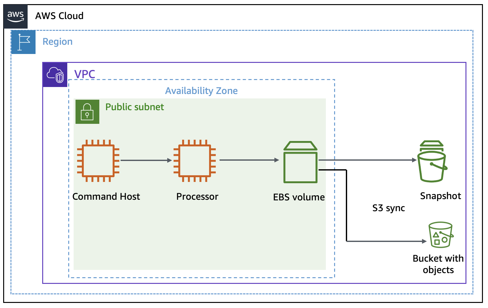

# AWS Python EBS Snapshots (IN PROGRESS)

<div align="center">
  
</div>

## Overview
This project is divided into two parts: 
- Part 1 focuses on setting up the architecture necessary to conduct the lab, including creating a VPC, subnets, and EC2 instances. 
- Part 2 automates the management of EBS snapshots, deletion of old snapshots, syncing local files with S3 for backup, and utilizing versioning for file recovery.

---
⚠️ **Attention:**
- All the tasks will be completed via the command line using AWS CLI. Ensure you have the necessary permissions. [Install AWS CLI](https://docs.aws.amazon.com/cli/latest/userguide/getting-started-install.html)
- Charges may apply for completing this lab. [AWS Pricing](https://aws.amazon.com/pricing/)
---

# Part 1: Architecture Preparation

---

## Step 1: Set Up a VPC
#### 1.1. Create a VPC to house all the resources in a specific region:
```bash
aws ec2 create-vpc --cidr-block 10.0.0.0/16
```

---

## Step 2: Create a Public Subnet
#### 2.1. Create a public subnet where the EC2 instances will be hosted:
```bash
aws ec2 create-subnet \
	--vpc-id <vpc-id> \
	--cidr-block 10.0.1.0/24 \
	--availability-zone <your-az>
```

---

## Step 3: Create Internet Gateway and Public Route Table
#### 3.1. Create an Internet Gateway (IGW):
```bash
aws ec2 create-internet-gateway
```
An IGW is necessary to allow public internet access for the EC2 instances in the public subnet.

#### 3.2. Attach the IGW to your VPC:
```bash
aws ec2 attach-internet-gateway \
	--internet-gateway-id <igw-id> \
	--vpc-id <vpc-id>
```

#### 3.3. Create a Public Route Table:
```bash
aws ec2 create-route-table --vpc-id <vpc-id>
```
This route table will allow instances in the public subnet to communicate with the internet.

#### 3.4. Add a Route to the Internet Gateway in the Public Route Table:
```bash
aws ec2 create-route \
	--route-table-id <route-table-id> \
	--destination-cidr-block 0.0.0.0/0 \
	--gateway-id <igw-id>
```

#### 3.5. Associate the Public Subnet with the Route Table:
```bash
aws ec2 associate-route-table \
	--route-table-id <route-table-id> \
	--subnet-id <subnet-id>
```

---

## Step 4: Create Security Groups
#### 4.1. Create and configure a security group for the Command Host instance, allowing SSH access:
```bash
aws ec2 create-security-group \
	--group-name CommandHostSG \
	--description "Security group for Command Host"
```
```bash
aws ec2 authorize-security-group-ingress \
	--group-id <command-host-sg-id> \
	--protocol tcp \
	--port 22 \
	--cidr <your-ip>/32
```

#### 4.2. Create a security group for the Processor instance and allow SSH access from the Command Host:
```bash
aws ec2 create-security-group \
	--group-name ProcessorSG \
	--description "Security group for Processor"
```
```bash
aws ec2 authorize-security-group-ingress \
	--group-id <processor-sg-id> \
	--protocol tcp \
	--port 22 \
	--source-group <command-host-sg-id>
```

---

## Step 5: Launch Command Host EC2 Instance
#### 5.1. This instance will manage and control other resources:
```bash
aws ec2 run-instances \
	--image-id ami-<your-ami-id> \
	--instance-type t2.micro \
	--key-name <your-key-pair> \
	--subnet-id <subnet-id> \
	--associate-public-ip-address \
	--security-group-ids <command-host-sg-id>
```

---

## Step 6: Launch Processor EC2 Instance
#### 6.1. This instance will interact with the default EBS volume attached to it for processing data:
```bash
aws ec2 run-instances \
	--image-id ami-<your-ami-id> \
	--instance-type t2.micro \
	--key-name <your-key-pair> \
	--subnet-id <subnet-id> \
	--security-group-ids <processor-sg-id>
```

---

# Part 2: Automating EBS Snapshots and Syncing to S3

---

## Step 7: Schedule EBS snapshots to be taken every minute using cron.
#### 7.1. SSH into the Processor instance.
#### 7.2. Add the following cron job to create a snapshot every minute:
```bash
* * * * * aws ec2 create-snapshot --volume-id <volume-id> --description "Automated snapshot"
```

---

## Step 8: Stop Cron Job
#### 8.1. nce sufficient snapshots are created, stop the cron job by editing the cron configuration:
```bash
crontab -e
```

---

## Step 9: Python Script to Delete Old Snapshots
#### 9.1. Install Boto3:
```bash
sudo python3.7 -m pip install boto3
```

- Before running the cleanup script, let's list all the snapshots that have been taken to ensure we have proper control before stopping the cron job and deleting the old snapshots.

#### 9.2. List All Snapshots:
```bash
aws ec2 describe-snapshots \
	--filters "Name=volume-id, Values=<VOLUME-ID>" \
	--query 'Snapshots[*].SnapshotId'
```

#### 9.3. Python Script:
- Save the script below as snapshot_cleanup.py and execute it to delete the oldest snapshots, keeping only the two most recent ones:
```bash
#!/usr/bin/env python

import boto3

MAX_SNAPSHOTS = 2  # Number of snapshots to keep

# Create the EC2 resource
ec2 = boto3.resource('ec2')

# Get a list of all volumes
volume_iterator = ec2.volumes.all()

# Create a snapshot of each volume
for v in volume_iterator:
    v.create_snapshot()

    # Too many snapshots?
    snapshots = list(v.snapshots.all())
    if len(snapshots > MAX_SNAPSHOTS):
        # Delete oldest snapshots, but keep MAX_SNAPSHOTS available
        snap_sorted = sorted([(s.id, s.start_time, s) for s in snapshots], key=lambda k: k[1])
        for s in snap_sorted[:-MAX_SNAPSHOTS]:
            print("Deleting snapshot", s[0])
            s[2].delete()
```

---

## Step 10: Sync Local Files with S3 and Use Versioning for Recovery
- In this step, you'll download a set of sample files, create an Amazon S3 bucket, enable versioning to track changes, and test file recovery from S3 using versioning.
---
#### 10.1. Create an S3 bucket:
```bash
aws s3api create-bucket --bucket <your-bucket-name> --region <your-region>
```
#### 10.2. Download Sample Files
```bash
wget https://aws-tc-largeobjects.s3.us-west-2.amazonaws.com/CUR-TF-100-RSJAWS-3-23732/183-lab-JAWS-managing-storage/s3/files.zip
```
#### 10.3. Unzip the Files
```bash
unzip files.zip
```
#### 10.4. Enable Versioning on Your S3 Bucket:
```bash
aws s3api put-bucket-versioning \
	--bucket <your-bucket-name> \
	--versioning-configuration Status=Enabled
```
- To ensure that any changes or deletions to files are tracked, you need to activate versioning on your S3 bucket. Run the following command to enable versioning on your bucket
- This ensures that every time you modify or delete a file in the S3 bucket, the previous version is retained, allowing for easy recovery.
#### 10.5. Sync Files to S3 Bucket:
```bash
aws s3 sync ./files/ s3://<your-bucket-name>/
```
- Sync the unzipped folder with your S3 bucket. This will upload all the files from the local directory to the S3 bucket. Use the following command to sync the folder
- This command will upload the files from the ./files/ directory to your S3 bucket.
#### 10.6. Sync with Deletion Capability
```bash
aws s3 sync ./files/ s3://<your-bucket-name>/ --delete
```
- To ensure that any local file deletion is reflected in the S3 bucket, use the --delete flag with the sync command. This flag deletes files from the S3 bucket when the corresponding file is deleted locally
- If you delete a file locally and re-run this command, the corresponding file in the S3 bucket will be deleted as well.

---

## Step 11: Recover Deleted Files Using Versioning
#### 11.1. Liste the versions of the deleted file:
```bash
aws s3api list-object-versions --bucket <your-bucket-name> --prefix <file-name>
```
- Since versioning is enabled, even when a file is deleted, its previous version is still stored in the S3 bucket.
#### 11.2. Use the following command to restore a specific version of the deleted file:
```bash
aws s3 cp s3://<your-bucket-name>/<file-name> --version-id <version-id> ./files/
```
- Now, your deleted file will be restored from a previous version stored in S3!


